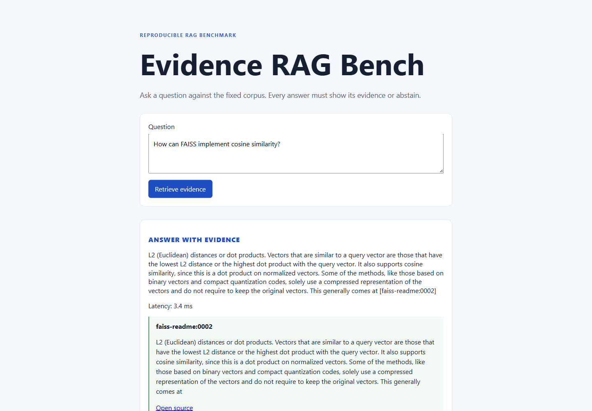
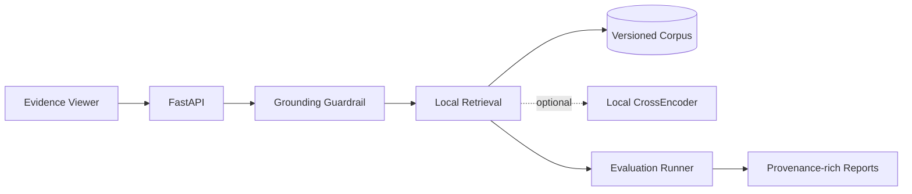

<div align="center">

# Evidence RAG Bench

**A compact RAG system that treats evidence—not fluent text—as the unit of trust.**

<p>
  <a href="https://github.com/SCUliujiacheng/evidence-rag-bench/actions/workflows/ci.yml"></a>
  
  <a href="LICENSE"></a>
</p>

[Why I built this](#why-i-built-this) · [Design tour](#three-minute-design-tour) · [Architecture](#architecture) · [Run locally](#run-locally)

**English** · [简体中文](https://github.com/SCUliujiacheng/evidence-rag-bench-zh)

</div>

## Why I built this

What interests me about RAG is not simply whether it can produce a convincing answer. I want to know whether a reader can inspect *why* the system answered—and whether the system can stop when its corpus cannot support a claim.

I built Evidence RAG Bench to make that boundary concrete. Inputs are versioned, retrieval is measured, citation IDs are checked against returned evidence, and insufficient evidence becomes an explicit abstention rather than a confident guess.

<p align="center">
  
</p>

<p align="center"><sub>A local answer is useful only when the supporting evidence remains visible and verifiable.</sub></p>

## Three-minute design tour

| Design concern | Inspectable evidence |
| --- | --- |
| Reproducible inputs | 15 license-attributed source documents are hash-locked before deterministic chunking; see the [corpus manifest](data/corpus/open_source_manifest.jsonl) and [validation code](src/evidence_rag_bench/corpus/manifest.py). |
| Measured retrieval | A versioned protocol with 25 development and 25 test cases (21 evidence-labelled cases per split) compares lexical, hybrid, and optional local semantic ranking; see the [benchmark results](docs/benchmark-results.md). |
| Grounded behavior | Every citation must belong to the returned evidence; low-confidence requests produce a structured abstention in the [grounding service](src/evidence_rag_bench/grounding/service.py). |
| Inspectable delivery | Reports retain configuration, manifest hash, Git revision, metrics, latency, and per-case traces through the [evaluation runner](src/evidence_rag_bench/evaluation/runner.py). |

> **Current protocol-v0.1 snapshot at `k=3`:** RRF hybrid reaches **0.90 Recall@3** and **0.73 nDCG@3**. The optional local CrossEncoder reaches **0.74 MRR@3** and **0.77 nDCG@3**. It improves ranking quality, but it is a relevance model—not an entailment verifier. The [full protocol and results](docs/benchmark-results.md) include exact settings, failures, and limitations.

## Architecture

[Open the interactive architecture](docs/architecture/evidence-rag-bench-architecture.html) to explore the request, retrieval, grounding, and evaluation paths. Its auditable source is checked in beside it as [JSON](docs/architecture/evidence-rag-bench.architecture.json).



## Run locally

The default hybrid path needs Python 3.12 and [`uv`](https://docs.astral.sh/uv/), but no API key or GPU:

**PowerShell**

```powershell
uv sync --python 3.12
uv run pytest -v
uv run python -m evidence_rag_bench.evaluation.runner `
  --split dev `
  --k 3 `
  --retriever hybrid `
  --manifest open_source_manifest.jsonl `
  --cases open_source_dev.jsonl
uv run uvicorn evidence_rag_bench.api.app:create_app `
  --factory `
  --port 8000
```

<details>
<summary>Bash / Git Bash equivalent</summary>

```bash
uv sync --python 3.12
uv run pytest -v
uv run python -m evidence_rag_bench.evaluation.runner \
  --split dev \
  --k 3 \
  --retriever hybrid \
  --manifest open_source_manifest.jsonl \
  --cases open_source_dev.jsonl
uv run uvicorn evidence_rag_bench.api.app:create_app \
  --factory \
  --port 8000
```

</details>

Open `http://127.0.0.1:8000/`. The viewer returns either evidence-bound citations or an explicit abstention.

<details>
<summary>An existing Windows checkout reports a corpus checksum mismatch</summary>

The byte-preservation rule applies automatically to fresh checkouts. If the repository was checked out before that rule existed, first make sure `git status --short -- data/corpus` prints nothing, then refresh only the tracked corpus files once:

```text
git rm -r --cached -- data/corpus
git restore --source=HEAD --staged --worktree -- data/corpus
```

</details>

To reproduce the optional semantic re-ranking experiment:

```powershell
uv sync --extra semantic --python 3.12
uv run --extra semantic python -m evidence_rag_bench.evaluation.runner `
  --split test `
  --retriever semantic-rerank `
  --k 3 `
  --manifest open_source_manifest.jsonl `
  --cases open_source_test.jsonl
```

<details>
<summary>Bash / Git Bash equivalent</summary>

```bash
uv sync --extra semantic --python 3.12
uv run --extra semantic python -m evidence_rag_bench.evaluation.runner \
  --split test \
  --retriever semantic-rerank \
  --k 3 \
  --manifest open_source_manifest.jsonl \
  --cases open_source_test.jsonl
```

</details>

## API example

```powershell
$body = @{
  question = "How can FAISS implement cosine similarity?"
  top_k = 3
} | ConvertTo-Json

Invoke-RestMethod `
  -Method Post `
  -Uri "http://127.0.0.1:8000/v1/ask" `
  -ContentType "application/json" `
  -Body $body
```

<details>
<summary>Bash / Git Bash equivalent</summary>

```bash
curl -X POST http://127.0.0.1:8000/v1/ask \
  -H "content-type: application/json" \
  -d '{"question":"How can FAISS implement cosine similarity?","top_k":3}'
```

</details>

Responses expose the decision (`answer` or `abstain`), a deterministic answer string, confidence, and chunk-level citations. Citation IDs in an `answer` response always refer to returned evidence; an abstention never invents a citation.

## What is evaluated

Versioned JSONL development and test cases measure Recall@k, MRR@k, and nDCG@k over gold evidence IDs. The loader rejects duplicate case IDs, duplicate normalized questions, cross-split question reuse, and labels that conflict with answerability. Abstention thresholds are selected from development cases only. Generated reports record the corpus-manifest hash, Git revision, timestamp, and configuration under ignored `artifacts/reports/`.

The test results were inspected during early development and influenced the demo retriever choice; the split also grew from 8 to 25 cases as the corpus expanded. The current v0.1 test data is therefore a reproducible regression snapshot, not evidence of blind generalization. From v0.1 onward, new model and parameter choices are made on development data first. Expanding the test split requires a new protocol version that preserves the old snapshot, and a new generalization claim requires a newly sealed, unseen test set. The historical choice is recorded in the [decision log](docs/decision-log.md).

The default demo uses fifteen hash-locked, license-attributed technical documents from FAISS, scikit-learn, and LangChain. This is a compact benchmark, not a general performance claim.

## Design record

The repository keeps its decisions inspectable rather than hiding them behind the final demo:

- [Design specification](docs/superpowers/specs/2026-09-01-evidence-rag-bench-design.md)
- [Implementation plan](docs/superpowers/plans/2026-09-01-evidence-rag-bench-mvp.md)
- [Data attribution](docs/data-attribution.md)
- [Benchmark results](docs/benchmark-results.md)
- [Optional semantic re-ranking protocol](docs/semantic-reranking.md)
- [Decision log](docs/decision-log.md)
- [Manual evaluation rubric](docs/evaluation-rubric.md)

## License

The project code is released under the [MIT License](LICENSE). Corpus documents retain their upstream licenses; see [data attribution](docs/data-attribution.md).
