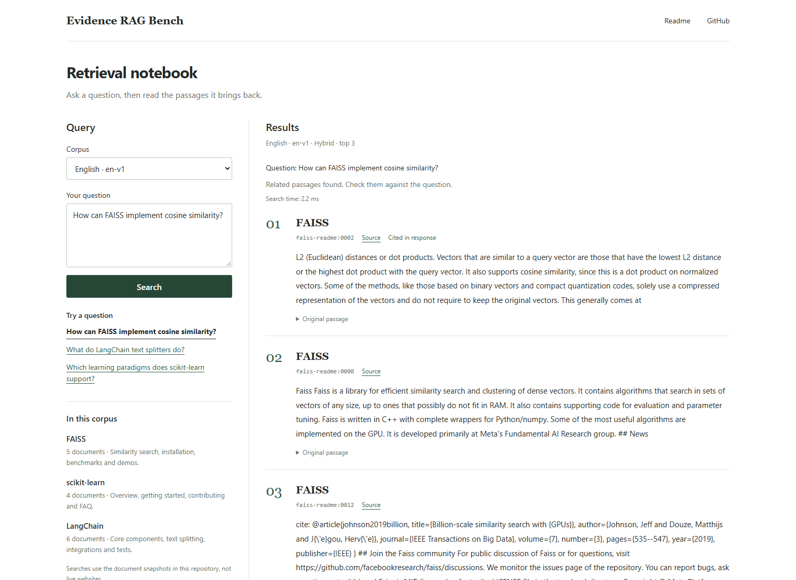
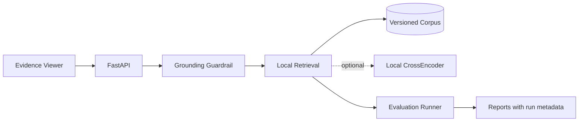

<div align="center">

# Evidence RAG Bench

**A small English-and-Chinese RAG benchmark for checking what an answer actually retrieved.**

<p>
  <a href="https://github.com/SCUliujiacheng/evidence-rag-bench/actions/workflows/ci.yml"></a>
  
  <a href="LICENSE"></a>
</p>

[The question](#the-question-behind-this-repo) · [The experiment](#what-i-tested) · [Architecture](#architecture) · [Run locally](#run-locally)

**English** · [简体中文](https://github.com/SCUliujiacheng/evidence-rag-bench-zh)

</div>

## The question behind this repo

I wanted a small experiment for one question: when a RAG answer looks plausible, what did it actually retrieve? If I cannot trace the answer to a passage, I cannot tell whether retrieval worked.

I fixed two small technical corpora, ran BM25, TF-IDF, and RRF Hybrid over the same chunks, then added two rules: a citation must point to evidence returned in that request, and a weak match becomes `abstain`. The English profile also has an optional CrossEncoder experiment. I record where the documents came from and note that I viewed both test sets while developing the project.

<p align="center">
  
</p>

<p align="center"><sub>The viewer keeps the retrieved passages beside the answer.</sub></p>

## What I tested

| Question | What the repository does about it |
| --- | --- |
| Can someone rerun the same retrieval? | `en-v1` locks 15 vendored English files by SHA-256; `zh-v1` additionally points its 3 Chinese files at exact upstream commits. Both record source and license details before chunking; see the [data attribution](docs/data-attribution.md). |
| How do the retrievers differ on the same cases? | Each profile has separate development and fixed test JSONL. The English split has 25 cases; the Chinese split has 9. See the [benchmark results](docs/benchmark-results.md). |
| Is a citation actually from this answer's evidence? | Each citation must belong to the returned evidence. Low-confidence requests take the structured abstention path in the [grounding service](src/evidence_rag_bench/grounding/service.py). |
| What happened on a particular run? | The [evaluation runner](src/evidence_rag_bench/evaluation/runner.py) keeps configuration, manifest hash, Git revision, metrics, latency, and per-case traces. |

> **Current `k=3` snapshots:** on `en-v1`, RRF Hybrid reaches **0.90 Recall@3** and **0.73 nDCG@3**. On the smaller `zh-v1` set it reaches **1.00 Recall@3**, **1.00 MRR@3**, and **0.99 nDCG@3**. Those are fixed regression numbers from small corpora, not general RAG scores. The [full results](docs/benchmark-results.md) include the much less flattering abstention results too.

## Architecture

[Open the interactive architecture](docs/architecture/evidence-rag-bench-architecture.html) for the request, retrieval, grounding, and evaluation paths. The [JSON source](docs/architecture/evidence-rag-bench.architecture.json) sits beside it so the diagram is reviewable too.


```mermaid
flowchart LR
    UI[Evidence Viewer] --> API[FastAPI]
    API --> Guard[Grounding Guardrail]
    Guard --> Retrieval[Local Retrieval]
    Retrieval --> Corpus[(Versioned Corpus)]
    Retrieval -. optional .-> Reranker[Local CrossEncoder]
    Retrieval --> Eval[Evaluation Runner]
    Eval --> Reports[Reports with run metadata]
```

## Run locally

The default hybrid path needs Python 3.12 and [`uv`](https://docs.astral.sh/uv/), but no API key or GPU. The English repository starts on `en-v1`; use `--profile zh-v1` for the Chinese corpus.

**PowerShell**

```powershell
uv sync --python 3.12
uv run pytest -v
uv run python -m evidence_rag_bench.evaluation.runner `
  --profile en-v1 `
  --split dev `
  --k 3 `
  --retriever hybrid
uv run python -m evidence_rag_bench.evaluation.runner `
  --profile zh-v1 `
  --split test `
  --k 3 `
  --retriever hybrid
uv run uvicorn evidence_rag_bench.api.app:create_app `
  --factory `
  --port 8000
```

<details>
<summary>Bash / Git Bash equivalent</summary>

```bash
uv sync --python 3.12
uv run pytest -v
uv run python -m evidence_rag_bench.evaluation.runner \
  --profile en-v1 \
  --split dev \
  --k 3 \
  --retriever hybrid
uv run python -m evidence_rag_bench.evaluation.runner \
  --profile zh-v1 \
  --split test \
  --k 3 \
  --retriever hybrid
uv run uvicorn evidence_rag_bench.api.app:create_app \
  --factory \
  --port 8000
```

</details>

Open `http://127.0.0.1:8000/`, choose **English corpus** or **中文语料**, and ask a question. The viewer returns either evidence-bound citations or an explicit abstention.

<details>
<summary>An existing Windows checkout reports a corpus checksum mismatch</summary>

The byte-preservation rule applies automatically to fresh checkouts. If the repository was checked out before that rule existed, first make sure `git status --short -- data/corpus` prints nothing, then refresh only the tracked corpus files once:

```text
git rm -r --cached -- data/corpus
git restore --source=HEAD --staged --worktree -- data/corpus
```

</details>

To reproduce the optional semantic re-ranking experiment:

```powershell
uv sync --extra semantic --python 3.12
uv run --extra semantic python -m evidence_rag_bench.evaluation.runner `
  --profile en-v1 `
  --split test `
  --retriever semantic-rerank `
  --k 3
```

<details>
<summary>Bash / Git Bash equivalent</summary>

```bash
uv sync --extra semantic --python 3.12
uv run --extra semantic python -m evidence_rag_bench.evaluation.runner \
  --profile en-v1 \
  --split test \
  --retriever semantic-rerank \
  --k 3
```

</details>

The MiniLM checkpoint used here was trained for English passage ranking, so `semantic-rerank` deliberately rejects `zh-v1`. The Chinese profile stays on the dependency-free lexical and hybrid paths until a multilingual reranker gets its own protocol.

## API example

```powershell
$body = @{
  profile = "zh-v1"
  question = "BGE-M3 支持哪三种检索方式？"
  top_k = 3
} | ConvertTo-Json

Invoke-RestMethod `
  -Method Post `
  -Uri "http://127.0.0.1:8000/v1/ask" `
  -ContentType "application/json" `
  -Body $body
```

<details>
<summary>Bash / Git Bash equivalent</summary>

```bash
curl -X POST http://127.0.0.1:8000/v1/ask \
  -H "content-type: application/json" \
  -d '{"profile":"zh-v1","question":"BGE-M3 支持哪三种检索方式？","top_k":3}'
```

</details>

Responses include the selected profile, the decision (`answer` or `abstain`), a deterministic answer string, search latency, evidence, and chunk-level citations. In an `answer` response, every citation ID refers to returned evidence; an abstention has no invented citation.

The score threshold is most useful for questions far outside the corpus. A
question can still mention the right topic while asking for a detail or
preference the passage never states. The viewer therefore says **relevant
evidence found—verify below**, not that it proved an answer.

## What is evaluated

Versioned JSONL development and test cases measure Recall@k, MRR@k, and nDCG@k over gold evidence IDs. The loader rejects duplicate case IDs, duplicate normalized questions, cross-split question reuse, and labels that conflict with answerability. Each profile selects its own abstention threshold from its development cases. Generated reports record the profile, corpus-manifest hash, Git revision, timestamp, and configuration under ignored `artifacts/reports/`.

I looked at the English test results during early development when choosing the demo retriever, and I used the Chinese test questions while checking the new tokenizer and chunker. Both are now fixed regression sets, not blind evaluations. New model and parameter choices belong on the matching development split first. A generalization claim would need a newly sealed, unseen test set. The history is recorded in the [decision log](docs/decision-log.md).

The default demo uses fifteen English documents from FAISS, scikit-learn, and LangChain. `zh-v1` adds three Chinese README snapshots from Milvus, PaddlePaddle, and FlagEmbedding. Keep those small corpora in mind when reading the tables.

## Notes and results

For the details behind the demo:

- [Data attribution](docs/data-attribution.md)
- [Benchmark results](docs/benchmark-results.md)
- [Optional semantic re-ranking protocol](docs/semantic-reranking.md)
- [Decision log](docs/decision-log.md)
- [Manual evaluation rubric](docs/evaluation-rubric.md)

## License

The project code is released under the [MIT License](LICENSE). Corpus documents retain their upstream licenses; see [data attribution](docs/data-attribution.md).
